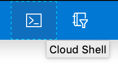

# AKS

This script will allow you to run this workshop in Azure Kubernetes Service.

## Usage

* Open a cloud shell in Azure by clicking on the cloud shell icon in the top bar of the Azure portal.



* If necessary, choose bash and follow instructions to provision basic storage.
* In the cloudshell, run the following to create a basic cluster.

```
cd ~/clouddrive
git clone https://github.com/fairwindsops/k8s-workshop
cd k8s-workshop/aks
source ./setup.sh
```
