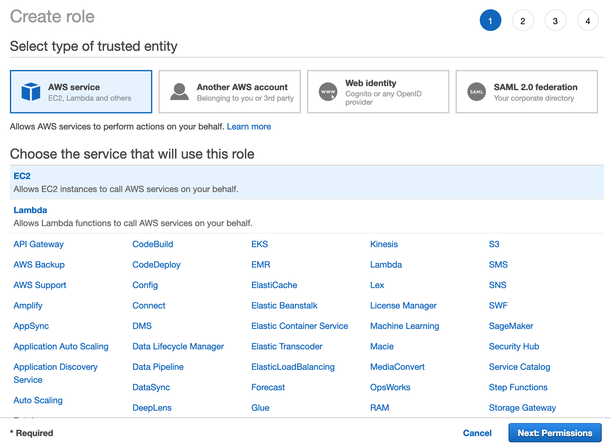
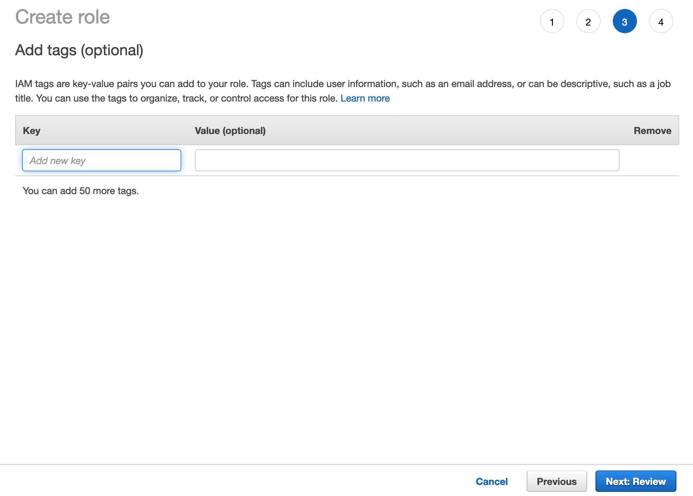
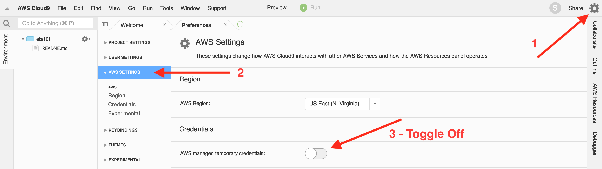

# EKS 101
1. [Create Cloud9 Environment](#create-cloud9-environment)
2. [Create Admin Role for Cloud9 Environment](#create-role)
3. [Attach Role to Cloud9 Environment](#attach-role-to-cloud9-environment)
4. [Turn Off Temorary Credentials in Cloud9](#turn-off-temporary-creds)
5. [Clone k8sworkshop Repo](#clone-k8sworkshop-repo)
6. [Create EKS Cluster](#create-eks-cluster)
7. [Delete EKS Cluster](#delete-eks-cluster)

## Create Cloud9 Environment
Click the link below to create a Cloud9 console environment

<a href="https://us-west-2.console.aws.amazon.com/cloud9/home?region=us-west-2" target="_blank">Cloud9</a>

You can use the default settings and the default VPC for the cloud9 environment.

## Create Role
Click the link below to create an Instance Profile to Attach to your Cloud9 Environment

<a href="https://console.aws.amazon.com/iam/home#/roles$new?step=review&commonUseCase=EC2%2BEC2&selectedUseCase=EC2&policies=arn:aws:iam::aws:policy%2FAdministratorAccess" target="_blank">AWS IAM</a>

### Select EC2 as the type of trusted entity


### Grant administrator access


### No tags are necessary


### Give the role a name and description


## Attach role to Cloud9 Environment

Go to the EC2 instance that cloud9 created.

<a href="https://us-west-2.console.aws.amazon.com/ec2/v2/home?region=us-west-2#Instances:sort=desc:launchTime" target="_blank">Cloud 9 Instance</a>

### Select the instance and modify the roles attached


### Select the role you created in the previous step


### Apply the role to the instance


## Turn off temporary creds

* In Cloud9 Environment, go to preferences `⌘,`
* Go to *AWS SETTINGS*, then _Credentials_
* Toggle _AWS managed temporary credentials_ to off



## Clone k8s-workshop Repo
Clone the k8s-workshpo repo and checkout the `eks` branch

```
sudo su -
git clone https://github.com/reactiveops/k8s-workshop.git
cd k8s-workshop
```

## Create EKS cluster
```
cd eks
./scripts/deps.sh
./scripts/create-cluster.sh
```

## Delete EKS Cluster
```
./scripts/delete-cluster.sh
```
